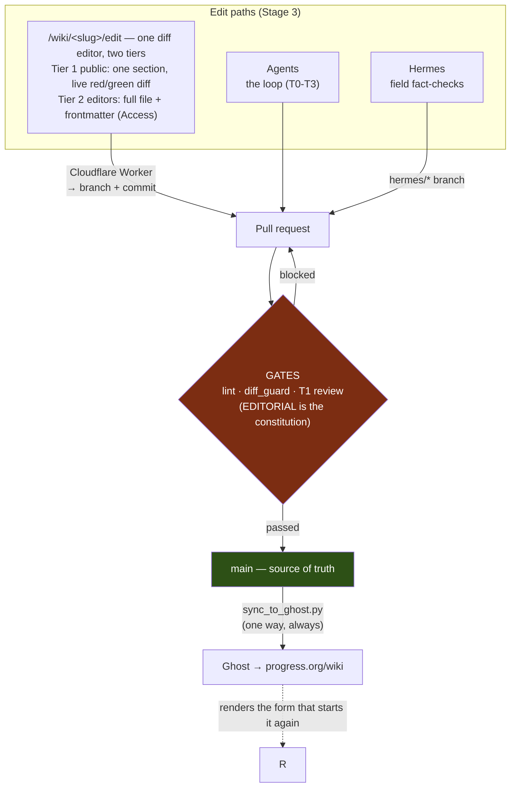

# Architecture — Stages 3–5 (community, autonomy, authority)

*Written 2026-08-05 (T1, at Floyd's request: "add a human editing feature"). This is the
design and build plan for the next three stages of the wiki's evolution. ROADMAP.md
carries the stage rows and status; this file carries the architecture. Nothing here is
built yet — every section states what exists today versus what is new work.*

**Verified infrastructure facts this plan rests on** (checked 2026-08-05, re-check before
building): progress.org is fronted by **Cloudflare** (`server: cloudflare`) with **Ghost
Pro** behind it (`via: varnish`) — so Workers, Access, and Pages are all available on the
apex domain. `https://www.progress.org/tag/wiki/rss/` **already returns 200** (the wiki
feed exists). `sitemap.xml` **already exists** as a Ghost-generated index
(`sitemap-pages/posts/authors/tags.xml`). `/rss/` and `/feed/` are 404 — the feed lives at
the tag route, not the site root.

---

## 0. The controlling constraint — read this before designing anything

**Git is the source of truth. Ghost is a render target, not a database.**

`scripts/sync_to_ghost.py` upserts every page by slug. Anything edited *in Ghost* — a
typo fix in the Ghost admin UI, a paragraph rewritten by a well-meaning editor — is
**silently destroyed** the next time that page syncs. There is no import path and no
conflict detection.

This single fact decides the shape of every feature below:

> **Every human-editing path must terminate in a git commit on `main`.**
> Ghost is always downstream. No feature may write page content to Ghost.

It rules out the most obvious reading of "a CMS at /wiki/admin" — a CMS that edits Ghost
posts would produce silent, un-diagnosable data loss on the next sync. The CMS must be
**git-backed**: it edits Markdown in the repo, opens a PR, and the existing publish path
carries the result to Ghost.

**Corollary for Stage 3's auto-merge:** merging to `main` is *publishing*. There is no
staging buffer between a merged PR and the live site beyond the sync run. Auto-merge is
therefore auto-publish, and must be scoped accordingly (§3.3).

---

## Stage 3 — Community layer

Goal: let the Georgist community contribute without GitHub knowledge, without weakening
the evidence standard that makes the wiki worth citing.

### 3.1 The edit surface — one app, two tiers

*Revised 2026-08-05 after Floyd asked whether submitters could get a real CMS/track-changes
experience rather than a form. The answer collapsed two planned components into one.*

The first draft of this plan had **two** separate things: a suggestion *form* for the
public and an off-the-shelf git-backed CMS (Decap/Sveltia) for editors. That's two
codebases, two UX conventions, and — because the CMS config restates the frontmatter
schema that `lint_wiki.py` already owns — a whole class of schema-drift bugs.

**Build one browser-based diff editor instead, with two permission tiers.** It gives the
public genuine track-changes editing, gives editors a real CMS, and removes the Decap
dependency entirely.

**Route:** `/wiki/<slug>/edit`, served by Cloudflare Pages + a Worker (not Ghost). The
theme's only job is the "Suggest an edit" / "Edit" button linking to it.

**How it works, both tiers:**

1. Worker fetches the page's current Markdown from GitHub.
2. Browser renders it in a Markdown editor (CodeMirror-class) with **a live inline diff
   against the original** — red/green as you type. *That is the track-changes UI*, and it
   is computed client-side, so it needs no backend session.
3. A preview toggle renders the Markdown as it will appear.
4. On submit: Worker validates, creates a branch, commits, and **opens a PR**.

**Tier 1 — public, no login.** Edits **one `##` section at a time**, not the whole file:
a 400-line page is intimidating and a whole-file textarea invites accidental damage.
Requires a rationale, and a source URL when the edit touches a factual claim — with the
standard stated in the UI next to the field: *"We cite every substantive claim. A
suggestion without a source can still flag a problem for us — but we can't publish a claim
we can't verify."* That is EDITORIAL rule 2 expressed as UX. Cloudflare Turnstile,
per-IP rate limits in Workers KV, length caps, HTML stripped. The PR is authored by the
GitHub App with the submitter credited in a `Suggested-by:` commit trailer, labelled
`suggestion`.

**Tier 2 — trusted editors, behind Cloudflare Access.** Same app, more surface: the whole
file, plus **frontmatter as structured form fields generated from lint's own schema** —
so evidence wiring (`supported_by`, `challenged_by`, `evidence_strength`) is editable with
validation, and there is no second schema to drift. Commits are attributed to the editor's
own GitHub identity via OAuth, because "who changed this claim" must survive in `git log`.

**Why a PR and not an Issue** (this reverses the first draft): the submission *is already
a diff*, so filing it as an Issue would just force someone to transcribe it back into one.
A PR runs lint and `diff_guard` automatically and reviews in the normal place. Spam PRs
are noisier than spam Issues — if that becomes real, downgrade Tier 1 to Issues-first and
promote on triage.

**Auth stays two-layer for Tier 2:** Cloudflare Access decides *who reaches the page*;
GitHub OAuth decides *whose name is on the commit*. Access alone would collapse every
editor into one bot identity in the history.

**Trade-off, stated honestly:** this is more custom code than configuring Decap (~3–4 days
versus ~2). What it buys: no upstream-maintenance risk, one UI instead of two, and the
schema-drift failure mode disappears rather than needing a CI check to catch it. Given the
wiki's lifespan is measured in years, I'd take the extra day.

### 3.2 Two alternatives considered and not taken

Recording these with reasons so the decision doesn't get relitigated from scratch.

#### Google Docs in suggesting mode — **not recommended**

The idea: "Suggest an edit" opens a Google Doc pre-filled with the page, set to suggesting
mode, and we harvest the tracked changes. Appealing because everyone already knows the UI.

Why it doesn't pay off:

- **The hard part gets harder, not easier.** Google returns suggestions as text ranges in
  a document that has *lost the Markdown structure* — headings, links, frontmatter,
  `<figure>` blocks. Mapping an accepted suggestion back onto the source file is manual
  work per suggestion. The diff editor in §3.1 produces a patch that applies to the source
  file directly.
- **Doc sprawl.** One document per suggestion per page, each needing permissions and
  garbage collection.
- **It probably breaks anonymity** — creating tracked *suggestions* generally requires
  being signed in to a Google account, which removes the main advantage of a web form.
  (Verify before dismissing on this ground alone.)
- **New blocked dependency.** It needs a Google service account, which ROADMAP already
  lists as unprovisioned — the registry Sheets mirror is blocked on exactly this.
- **Abuse surface.** A link-shared, editable document under the project's name is a
  defacement and phishing target.

The one genuine benefit — a familiar track-changes experience — is what §3.1 provides
natively.

#### Ghost as the editing platform, with write-back to GitHub — **feasible, but not the primary path**

The idea: editors edit the wiki page in Ghost's own admin UI; a webhook fires; something
converts it back to Markdown and opens a PR. Ghost is already the publishing surface, so
this is the least new UI of any option.

**It is technically possible.** Ghost fires `post.edited` and `post.published.edited`
webhooks (verified against Ghost's webhook docs), and the Admin API can return the post
body, so a Worker can convert and open a PR.

Four problems, in ascending order of severity:

1. **Frontmatter has nowhere to live.** `supported_by`, `challenged_by`,
   `evidence_strength`, `claim_type`, `last_reviewed` have no Ghost field. The most
   consequential edits simply can't be made there, and write-back must merge body-only
   while preserving git's frontmatter.
2. **Diff noise destroys reviewability.** Markdown → HTML → Ghost Lexical → back to
   Markdown will not round-trip byte-identically. Naive write-back produces a PR that
   rewrites the entire file, so "one sentence changed" and "400 lines reformatted" look
   the same to a reviewer. Fixable — normalize both sides and patch only changed blocks —
   but it's fiddly, and it needs re-testing whenever Ghost's editor output shifts.
3. **Two masters, no lock.** Sync is one-way today, so no race exists. Make Ghost writable
   and an agent merging to `main` can collide with an editor mid-edit; last writer wins,
   silently. Needs a per-slug lease that blocks sync while a Ghost edit is outstanding.
4. **It inverts the publish gate — the disqualifying one.** Ghost's role model, checked
   against Ghost's staff-roles documentation, has **no role that can edit an existing
   published post without also being able to publish it**: Contributors can only edit
   *their own drafts*, and the minimum role for editing someone else's published post is
   **Editor**, which publishes. So anyone who can fix a wiki page in Ghost can also push it
   live instantly — before lint, before `diff_guard`, before T1. The write-back PR would
   then document a change that is *already public*, turning review-then-publish into
   publish-then-review on a site whose whole claim is that every assertion was checked
   first.

**If you want it anyway** — and there's a fair case for a "fix an obvious typo without
leaving the site" path — the narrow version is: allow it, scope it to Tier A-shaped changes
(§3.3), implement block-level diffing and the per-slug lease, and accept publish-then-review
with a bot that opens the PR and pings T1 immediately. **Sequence it after §3.1**, because
if the diff editor is good, most of the demand for editing in Ghost disappears — and it
would then be an optional convenience rather than the load-bearing editor path.

### 3.3 Trust model and auto-merge — the part that needs care

Floyd's spec: *"PRs from known editors with passing lint merge automatically."*

**The problem with author-based trust alone.** `lint_wiki.py` is a **structural** gate. It
checks frontmatter completeness, link resolution, bidirectional evidence wiring, quote
length, banned-certainty words, marker counts, orphans. It is genuinely good at what it
does — and it *cannot* see:

- a number changed from 12% to 21%
- a `challenged_by` entry quietly deleted
- a source annotation rewritten to say something the source doesn't say
- a `[VERIFY]` marker removed without the verification actually happening
- an overclaim that dodges the banned-word list ("the evidence establishes…")

Every one of those passes lint green. On a site whose entire value proposition is *"every
claim cited, counter-evidence at full strength,"* auto-merging them because a trusted
person sent them is the single highest-risk change in this plan — and remember from §0
that merge means publish.

**The fix: trust is a function of *what the diff touches*, not only *who wrote it*.** Add
`scripts/diff_guard.py`, a new gate that classifies a PR's diff.

**Tier A — auto-mergeable** (all conditions required):
- author is in `.github/editors.yml`
- `lint_wiki.py` green
- `diff_guard` reports **no evidence-bearing change**
- diff under a line cap (start at 40 changed lines)

Qualifying changes: prose edits that alter no numeral, no quoted string and no
claim-strength verb; dead-link repair pointing at an archived copy of the same document;
adding a cross-link to an existing page; typo and grammar fixes.

**Tier B — always T1 review, regardless of author:**
- any change to evidence frontmatter — `supported_by`, `challenged_by`,
  `evidence_strength`, `claim_type`, `supports_outcomes`, `bears_on_objections`
- any change inside a blockquote or in a `## Sources` section
- **any numeral change anywhere**
- any new page, or any page deletion
- **any removal of a `[VERIFY]` / `[CITATION NEEDED]` marker** — removing a marker is an
  assertion that something was verified, which is exactly a T1 judgment
- any change to `EDITORIAL.md`, `LOOP.md`, `scripts/`, or `.github/`

`diff_guard` is what makes auto-merge *safe* rather than merely convenient. Without it,
"known editor + green lint" is a trust model that the lint gate cannot actually back.

**Auto-merge mechanics:** a GitHub Action on `pull_request` runs lint + diff_guard and,
on Tier A, enables native auto-merge. Branch protection requires both checks, so the
gates can't be bypassed by a direct push. Every auto-merged PR is logged to LOOPLOG by
the same Action, so the audit trail stays complete.

**Effort:** ~1.5 days (diff_guard + Action + branch protection + editors.yml).

### 3.4 Newsletter / RSS

**Mostly already built.** `https://www.progress.org/tag/wiki/rss/` returns 200 today —
Ghost generates it from the `wiki` primary tag, and Ghost has native email newsletters.
So this reduces to a digest generator, not a feed system.

**New work:** `scripts/build_digest.py` — diff the current `sources/wiki-inventory.csv`
census against the previous week's, cross-reference `git log`, and emit a "What's new in
the wiki" post published through the existing Ghost Admin API path (the same auth
`sync_to_ghost.py` already uses), tagged `wiki-digest`, with Ghost handling delivery.

Make the digest report **three distinct things**, because they mean different things to a
reader:
1. **New pages** — what the wiki now covers that it didn't
2. **Substantive revisions** — existing claims that changed
3. **Fact-checks resolved** — markers cleared, with what was verified

(3) is the wiki's actual differentiator and no other reference publishes it. It should
lead the digest, not be a footnote.

**Effort:** ~1 day.

### Stage 3 build order

1. **diff_guard + editors.yml** (§3.3) — the gate must exist before any path that opens
   PRs into it. Nothing else in Stage 3 is safe first.
2. **Diff editor, Tier 1** (§3.1) — public section-level editing with the live diff.
   Highest value per unit effort, and it proves the submit→PR pipeline end to end.
3. **Digest** (§3.4) — independent of the rest; gives the community something to
   subscribe to while Tier 2 is built.
4. **Diff editor, Tier 2** (§3.1) — Cloudflare Access, full-file editing, frontmatter
   fields generated from lint's schema, GitHub OAuth attribution.
5. *Optional, only if still wanted:* the narrow Ghost write-back path (§3.2).

A `CONTRIBUTING.md` should land with step 2 — the editor needs something to link to that
explains the evidence standard in full.

**Total: roughly 6–8 days of build**, against ~5–6 for the original two-component plan.
The extra day or two removes the Decap dependency and the schema-drift bug class.

---

## Stage 4 — Autonomous maintenance

**Honest framing before the plan: most of this already exists.** The wiki already runs a
daily scan into `sources/wiki-queue.json`, a deterministic dedup pass, a T0 context-brief
step over the full 919-page corpus, a consumed ledger with dispositions, and an
auto-committing census Action. Stage 4 is largely **productionizing and containing** what
runs today, not new capability. Mapping Floyd's bullets to reality:

| Floyd's item | Status today | Remaining work |
|---|---|---|
| Nightly scrape SSRN/Lincoln/NBER/IMF → sources index | **Largely built** — daily scan → queue → T0 briefs → consumed ledger | Widen the venue list; **fix the scanner's dedup** (it has re-emitted already-dispositioned URLs five days running — `scripts/clean_wiki_queue.py` is a downstream guard, not a fix); formalize the append into `sources/registry.csv` |
| Issue responder drafts a commit, opens PR | Not built; the loop already dispatches writers | The Issue→queue bridge from §3.1, plus an agent PR path. Output is **always a PR**, never a direct commit |
| Stub detector, 30+ days untouched | Data exists — lint STUBS gauge, census `stub` + `last_reviewed` | Scheduled Action → **one rolling tracking Issue**, not one Issue per stub (noise kills the signal) |
| Weekly citation health check | Precedent exists (16 registry 404s repaired by hand) | `scripts/link_health.py` + weekly Action; append findings to the **Hermes work order**, don't open 50 Issues |
| Trigger via chat (WhatsApp/Telegram) | Not built | See the security note below |

**Security note on the chat trigger.** An inbound chat webhook that can create wiki
content is an authenticated write path into a public reference site, reachable from a
phone number or handle. If built: allowlist sender IDs, treat every chat-originated
change as **Tier B** (never auto-merge), and never let it publish directly. The
convenience is real; the blast radius is a publicly-cited encyclopedia.

**Sequencing:** fix the scanner dedup first — it's a live defect producing daily noise,
and every other Stage 4 item adds volume on top of it.

---

## Stage 5 — Authority & discovery

### 5.1 Structured data and SEO — real, and we have an unusual advantage

Ghost already emits a sitemap index and basic Open Graph tags. The wiki-specific work is
theme-level JSON-LD, and here the wiki has an edge most sites don't: **its citations are
already structured data**. `supported_by`, `challenged_by`, `source_url`, `year` and
`authors` live in frontmatter, so the theme can emit a `schema.org/Article` (or
`ScholarlyArticle`) block with real `citation` entries — machine-readable evidence
graphs, not just a title and a date.

Work: theme JSON-LD template, canonical-URL hygiene, per-page OG images. Sitemap needs
nothing.

### 5.2 Wikipedia citations — I recommend against the plan as written

Adding progress.org links as references across Wikipedia is the pattern Wikipedia's
conflict-of-interest and citation-spam guidelines exist to stop. Done at any scale by
people connected to the site, it tends to get reverted, and it risks the domain being
blacklisted — which would cost far more than the backlinks are worth, and would damage
exactly the reputation this stage is meant to build.

**What I'd do instead, in increasing order of value:**

1. **Fix Wikipedia's citations to point at the primaries we've already verified.** We
   have read and located a large number of primary sources; Wikipedia articles on land
   taxation frequently cite weaker secondaries. Improving those is a genuine
   contribution, it's welcome under Wikipedia's norms, and it builds standing.
2. **Where our page really is the best available source for a fact**, propose it on the
   article's Talk page **with an explicit COI disclosure** and let uninvolved editors
   decide.
3. Never bulk-add, never add anonymously, never add from multiple accounts.

The backlinks that matter for authority will follow from (1) and (2) being done well.
This is Floyd's call, but I don't think a link campaign serves the goal.

### 5.3 Partnerships and academic outreach

Lincoln Institute, Henry George Foundation, Prosper Australia: ordinary relationship work,
no engineering blocker. The one technical enabler worth building is a **"cite this page"
widget** — a stable citable URL, a suggested citation string, and a permalink to the
page's state at a given date. Institutions link to things that are citable.

Emailing SSRN authors when their paper gets a wiki page is a good idea **framed as a
courtesy, not a backlink request** — "we've summarized your paper, here's the page, tell
us if we've misrepresented anything" is welcome and often produces corrections that
improve the page. "Please link to us" is spam. Keep volume low, personalize, honor
opt-outs, and mind bulk-email rules (CAN-SPAM / GDPR) if it ever becomes a list rather
than individual notes.

### 5.4 LLM training signal — the mechanism in the plan doesn't work

**You cannot submit a sitemap to Common Crawl and thereby be included.** Common Crawl
crawls the web broadly on its own schedule; there is no submission channel that
guarantees inclusion, and no "add my site" path that behaves like Google Search Console.

**What actually determines whether the wiki shows up in AI training data and AI answers:**

- **Be crawlable** — `robots.txt` must allow the crawlers you want. This is a values
  decision, not a technical one: whether to allow `GPTBot`, `ClaudeBot`, `CCBot` and
  similar is Floyd's call, and the answer here is plausibly "yes, deliberately," since
  the mission is for this material to be the reference that AI systems repeat.
- **Stable URLs** — never break `/wiki/<slug>/`; redirect on rename.
- **Clean semantic HTML** — headings, lists, real `<figure>`/`<figcaption>`. The theme
  already does much of this.
- **Inbound links from crawled domains** — which is what 5.3 actually buys, and another
  reason not to pursue 5.2 the risky way.

Recommend an explicit, documented `robots.txt` policy as the deliverable here, rather than
a Common Crawl submission that doesn't exist.

---

## Cross-cutting concerns

**Secrets.** Three new ones: the GitHub App private key (Worker secret), the Cloudflare
Access service token, and the CMS OAuth client secret. None may enter the theme repo — it
is public. The existing 1Password → session-env pattern covers local/agent use; Worker
secrets are managed in Cloudflare, not in git.

**Abuse surface, by path.** Suggestion form → public, unauthenticated, highest volume:
Turnstile, rate limits, and Issues-only containment. CMS → authenticated and small:
Access allowlist. Chat trigger → authenticated but remote: allowlist plus Tier B forever.

**Failure modes to design against, in priority order:**

1. **A Ghost-side edit is silently lost on the next sync** (§0). Mitigation: never build a
   Ghost-write path; document the constraint where an editor will actually see it —
   `CONTRIBUTING.md` and the CMS landing page.
2. **A lint-green but evidence-wrong change auto-publishes** (§3.3). Mitigation:
   `diff_guard`, Tier B, conservative line caps.
3. **CMS config and lint schema drift** (§3.2). Mitigation: the CI equality check.
4. **Suggestion volume swamps the loop.** Mitigation: the T0 brief step already triages
   batches; suggestions enter the same pipeline with the same dedup and disposition
   ledger, so the machinery scales with volume rather than against it.

---

## Open decisions for Floyd

1. **Initial trusted-editor list** for `.github/editors.yml` and Cloudflare Access — who,
   and GitHub or Google OAuth?
2. **AI crawler policy** (§5.4) — allow `GPTBot`/`ClaudeBot`/`CCBot` deliberately? I'd
   say yes given the mission, but it's a values call and it should be a documented
   decision, not a default.
3. **Wikipedia approach** (§5.2) — I'm recommending against a link campaign in favour of
   improving Wikipedia's own citations plus Talk-page proposals with COI disclosure.
   Confirm before anyone touches Wikipedia.
4. **Auto-merge line cap** — is 40 changed lines the right starting bar for Tier A, or
   should the first months be review-everything with auto-merge off?
