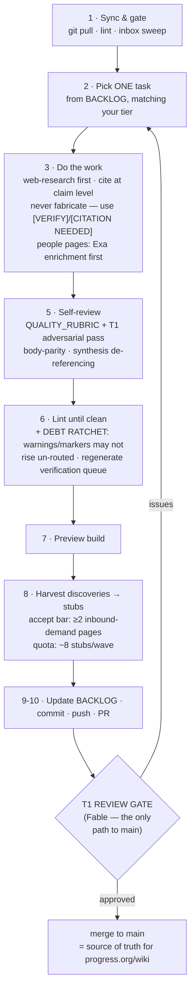
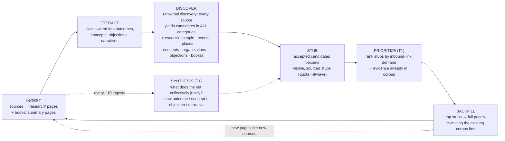
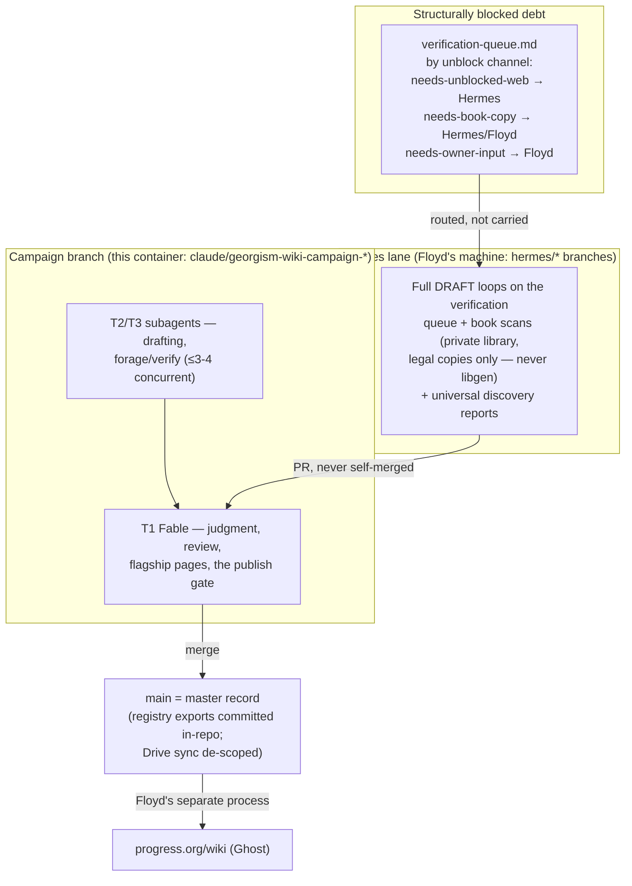

# The Wiki Improvement Loop — visual map

> **Sync rule (Floyd, 2026-07-06):** this diagram must always reflect what the loops actually
> do. Any change to LOOP.md's structure (steps, gates, lanes, roles) updates this file in the
> same commit. GitHub renders the Mermaid blocks natively — view this file on GitHub to see
> the pictures.

## 1. One iteration (LOOP.md steps 1–11)

Every wave, regardless of who runs it, walks this pipeline. The T1 gate is the only door to
`main`; nothing publishes from inside the loop (deployment to progress.org is Floyd's separate
process).

## 2. The growth flywheel (why the loop compounds)

Each turn of the wheel makes every earlier ingest more valuable: new pages re-mine old
sources, and every source scanned surfaces new warranted topics.

## 3. Lanes and agents (who runs what)

Two content lanes never collide: the campaign branch does new content; Hermes works
marker-carrying pages, books, and the verification queue. Both end at the same T1 gate.

## 4. The honesty machinery (what keeps it truthful)

- **Never fabricate** → unverifiable claims carry `[CITATION NEEDED]` / `[VERIFY]` markers;
  `scripts/verification_queue.py` ledgers every marker by unblock channel.
- **Lint gates** (`scripts/lint_wiki.py`): frontmatter schema · link resolution · bidirectional
  evidence wiring · BODY-PARITY · banned-certainty words · quote-length cap · conflict-marker
  and `[[wikilink]]` detection · registry duplicates · shadow-library provenance ban.
- **Counter-evidence at full strength**: outcomes carry `challenged_by`; objections are
  steelmanned; advocacy sources are labeled as advocacy (C/D-claims, never B).
- **T1 adversarial review** on everything before merge: *"what would a skeptical economist
  dispute, and does each claim's wording match its source's strength?"*
