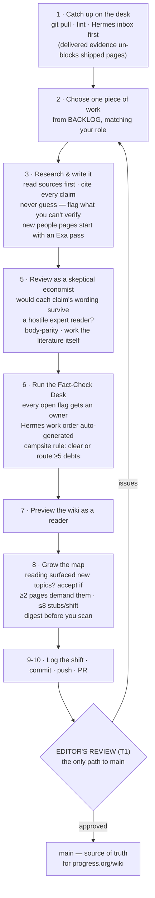
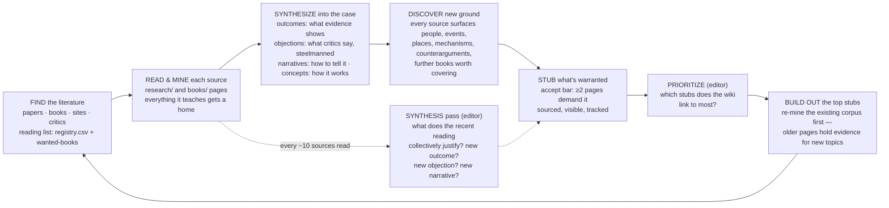
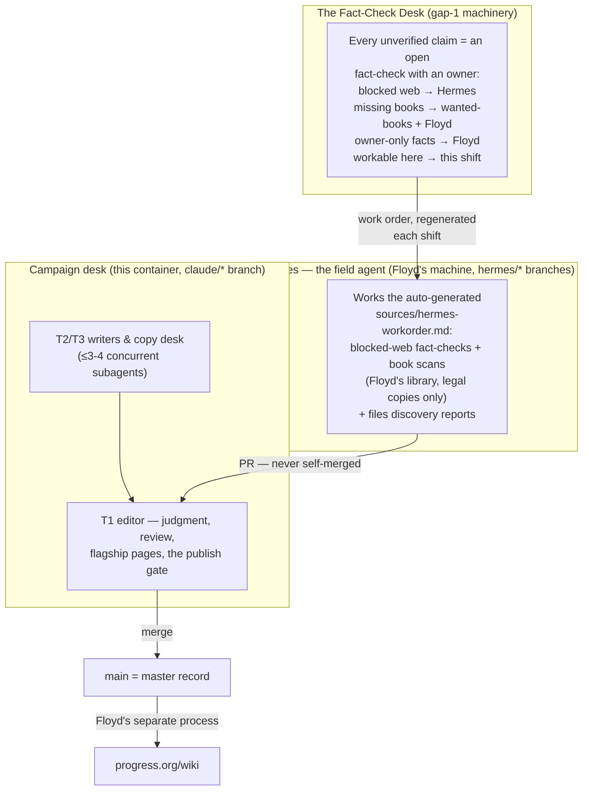

# How the Georgism Wiki Grows — visual map

> **Sync rule (Floyd, 2026-07-06):** this diagram must always reflect what the loops actually
> do. Any change to LOOP.md's structure (steps, gates, lanes, roles) updates this file in the
> same commit. GitHub renders the Mermaid blocks natively — view this file on GitHub to see
> the pictures.

**The mission:** the definitive, honest reference on Geoism — the capture of ALL economic
rents for public good, with Georgism/land as core and root (scope expanded 2026-07-06) —
every claim cited, every counterargument steelmanned, every important source read and mined,
and the rent gradient kept honest (land is the clean case; the frontier is contested). The
loop is the research desk that builds it.

## 1. One editorial shift (LOOP.md steps 1–11)

Every shift — whoever runs it — moves one piece of the wiki forward and leaves the
Fact-Check Desk cleaner than it found it. The editor's review is the only door to `main`.

## 2. The coverage flywheel (why the wiki compounds)

Reading Harrison's 1983 book gave the wiki Australian construction evidence for two outcome
pages, bios-in-waiting for the critics he cites, four books for the wanted list, and the
Japanese land bubble as a historical episode. Each of those, built out, cites new sources —
which get read, which surface more.

## 3. Lanes — who covers what (so agents never collide)

## 4. The honesty machinery (what keeps it truthful)

- **Never fabricate** → an unverifiable claim gets a visible `[CITATION NEEDED]` / `[VERIFY]`
  flag; the Fact-Check Desk ledgers every flag by owner and the count must trend down
  (the ratchet — new honest flags are fine, un-routed drift is not).
- **Lint gates** (`scripts/lint_wiki.py`): frontmatter schema · link resolution · bidirectional
  evidence wiring · body-parity · banned-certainty words · quote-length cap (public-domain
  works exempt — they may be held in full, EDITORIAL §3b) · conflict-marker and `[[wikilink]]`
  detection · registry duplicates · shadow-library provenance ban.
- **One finding, one home** (the delta rule): enrichments add only what's new to the wiki's
  coverage and link to a finding's home page rather than restating it.
- **Strongest evidence first**: supporting-research lists read in descending evidential
  weight — the reader who stops at item one has met the best evidence, not the first-drafted.
- **Counter-evidence at full strength**: outcomes carry `challenged_by`; objections are
  steelmanned (the homevoter objection is rated the wiki's strongest); advocacy sources are
  labeled advocacy (C/D-claims, never B).
- **The editor's adversarial pass** on everything before merge: *"what would a skeptical
  economist dispute, and does each claim's wording match its source's strength?"*
