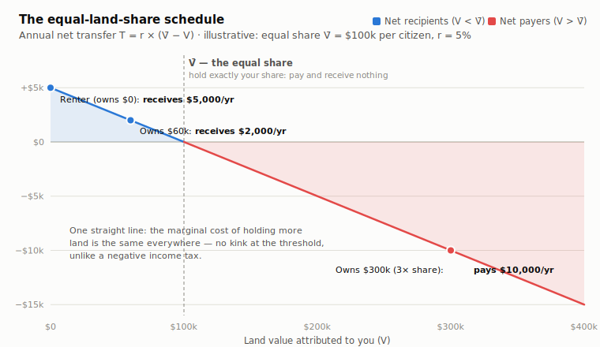
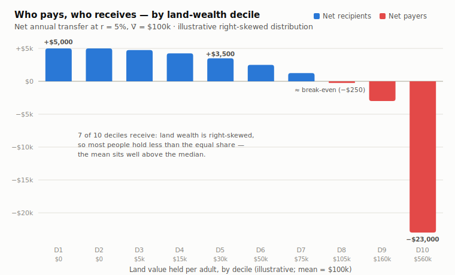

> **Status: proposal under active development** by Floyd Marinescu with Claude, in the
> `groundshare/` workspace of this repo. Not published to the wiki. The movement name
> **Groundshare** was coined by Sean Platt (MMT Nemacolin, 2026-04-23/24), evolving
> Floyd's earlier "earth-sharing" framing; companion tagline **"natural equity."**
> The mechanism's components are each well-attested in the literature cited below;
> the combined single-instrument formulation does not appear as a named proposal in
> the corpus the wiki has surveyed.

## Definition

The **equal land share** scheme starts from the Georgist premise that the value of
land — as distinct from the buildings and improvements on it — is created by nature
and by the community, not by the owner, and is therefore the equal common property of
all citizens (George 1879, Bk. VII; Paine 1797). It then implements that premise
directly, as a property settlement rather than as a tax-and-spend program:

1. **Compute the threshold.** Divide the nation's total assessed land value by its
   citizen population. Call this per-capita share **V̄** — the land value each citizen
   is morally entitled to.
2. **Net each person against the threshold.** A citizen whose attributed land value
   **V** is below V̄ *receives* an annual payment in proportion to the shortfall; a
   holder whose V exceeds V̄ *pays* in proportion to the excess. With an annual rate
   **r** (a fraction of land's rental yield), the net transfer is:

   **T = r × (V̄ − V)** — positive means receive, negative means pay.

A citizen who owns no land receives the full payment r·V̄ (the maximum — the position
of most renters); a citizen holding exactly the per-capita share neither pays nor
receives; payments from above-threshold holders fund the payouts, so the scheme
raises **zero net revenue** by construction — it is a pure transfer among citizens,
not a source of government funding.

## Formal Properties

**Equivalence to LVT plus citizen's dividend.** Algebraically, T = r·V̄ − r·V: the
scheme is *identical* to a flat-rate [land value tax](/wiki/land-value-tax/) at rate
r on every holding, combined with an equal [citizen's dividend](/wiki/citizens-dividend/)
of r·V̄ paid to every citizen — with the two flows netted into a single settlement.
Every incidence, efficiency, and capitalization result in the LVT literature
therefore carries over unchanged. (C-claim; follows directly from the definition.)

**One straight line — no kink.** The schedule superficially resembles Milton
Friedman's **negative income tax** (Friedman 1962, Ch. 12), which pays out below a
break-even income and collects above it. But the NIT schedule has a *kink* — the
marginal rate changes at the break-even point, which is where its work-incentive
problems live. The equal-land-share schedule is a single straight line through the
threshold: the marginal cost of holding one more dollar of land value is r
*everywhere*, above or below V̄. The threshold determines only who nets in or out,
never the marginal incentive — so the scheme inherits the LVT's neutrality (holding
land yields no return beyond its use value at full r; there is no gain to gaming
one's position around the threshold). (C-claim; theoretical.)

**A built-in majority of net recipients.** Land wealth is right-skewed — a minority
holds far more than the mean, so the mean exceeds the median and most citizens hold
less than V̄. The majority of citizens are therefore net *recipients* on day one.
This is the distributional finding of the wiki's LVT-progressivity evidence:
land ownership is concentrated at the top of the wealth distribution
([Saez & Zucman 2016](/wiki/saez-zucman-wealth-inequality/); see
[A land value tax can be progressive](/wiki/land-value-tax-can-be-progressive/)),
and [Common Wealth Canada's 2024 distributional modelling](/wiki/cwc-distributional-impacts-lvt/)
of a national LVT with a flat refundable credit — the same mathematics as this
scheme — found the credit turns the package progressive for most households.
(B-claim; empirical, via the cited distributional studies.)

**Netting minimizes gross fiscal flows.** Because only the *net* position moves
money, gross flows are far smaller than under separate tax-and-dividend
administration: a median homeowner slightly below V̄ receives a small cheque rather
than paying a large tax bill and receiving a large dividend. Detroit's proposed
land-value-tax credit design uses the same netting logic at municipal scale — a
credit guarantees no overall increase for below-break-even homeowners rather than
routing both flows separately (City of Detroit 2023). (D-claim; design analysis.)

*Both figures use illustrative round numbers (V̄ = $100,000 per citizen, r = 5%) and
an illustrative right-skewed decile distribution; they are not estimates for any
jurisdiction.*

## The Predistribution Framing

The scheme's proponents present it as **predistribution, not redistribution**: it
does not tax away the fruits of anyone's labor and hand them to others — the moral
vulnerability of income-based transfers — but settles who was owed what in the first
place. The framing has deep roots:

- **Thomas Paine** (1797) grounded his ground-rent-funded National Fund in exactly
  this distinction: every proprietor of cultivated land "owes to the community a
  ground-rent," and the payments funded from it are "not charity but a right"
  ([*Agrarian Justice*](/wiki/agrarian-justice/), held in full on this wiki).
- **Peter Barnes** (2014) applies it to modern commons dividends: "Dividends of this
  sort aren't redistribution; they're a way to allocate income fairly in the first
  place... they're legitimate property income" ([*With Liberty and Dividends for
  All*](/wiki/with-liberty-and-dividends-for-all/), Preface).
- **Hillel Steiner's "Global Fund"** is the closest structural precedent: in
  Steiner's left-libertarian theory of justice, every person is entitled to an equal
  share of all natural-resource values, and holders of more than their share owe
  payments into a fund disbursed equally — applied by Steiner at the level of
  nations rather than individual landholders (Steiner 1994; 2011). The equal land
  share is, in effect, Steiner's principle implemented domestically at the level of
  the individual citizen, with land value as the base.

The advocacy case for the framing: it asks nothing technical of the audience — no
tax rates, no revenue projections — only a moral judgment that each citizen is
entitled to an equal share of what none of them made. The schedule then follows
from the judgment by arithmetic.

## Design Questions

**Person-based, not parcel-based.** A conventional LVT is *in rem* — assessed on the
parcel regardless of who owns it. The equal land share must attribute land value to
*persons* to compute each citizen's V, which raises the question of land held
through corporations, trusts, and foreign owners. One design answer: give every
citizen a **land allowance** of V̄ (the analogue of a personal income-tax
allowance); land held by entities carries no allowance and pays the full rate r,
while citizens offset personally-attributed holdings against their allowance and
receive the unused balance in cash. Entity-held land is then taxed exactly as under
an in-rem LVT, and only owner-occupied and personally-held land needs attribution.
The difficulty of tracing beneficial ownership is real and documented — see
[the land-ownership-secrecy problem](/wiki/land-ownership-secrecy/). (D-claim;
design analysis.)

**The rate still exists.** Land *value* is a stock; the scheme transfers an annual
*flow*. The choice of r is the choice of how much of the rent is equalized: at r
equal to land's full rental yield, the entire annual value of holding more than
one's share is transferred, and the private return to holding land above one's
share — the speculative motive — is eliminated. Presenting the scheme as
"threshold plus proportion" moves the rate out of the moral foreground, but the
parameter remains, and assessments must be maintained exactly as under an LVT.

## What Would the Equal Share Be Worth in Canada?

First-pass estimate, built from the numbers already verified in the wiki's
[Common Wealth Canada research page](/wiki/natural-common-wealth-economic-rent-canada/)
(all figures verified there against the primary PDFs):

**The base.** Statistics Canada's National Balance Sheet Accounts (Table
36-10-0580-01) put Canada's total land value at roughly **$5.8 trillion (2022)**
(the July 2023 CWC revision's StatCan measurement; the January 2023 version used
$6.4T). Land rent at CWC's long-term 5.5% capitalization rate: **≈ $320 billion/year**.

**The equal share.** Two design choices give two thresholds:

| Design | Population base | Equal share V̄ | Max annual receipt (landless person, r = 5.5%) |
|---|---|---|---|
| Per resident (incl. children) | ≈ 40 million (2022–23) | **≈ $145,000** | **≈ $8,000/yr** |
| Per adult | 26.6 million (CWC's 2022 figure) | **≈ $219,000** | **≈ $12,000/yr** |

**Worked examples (per-resident design, r = 5.5%):**
- A renter family of four holds $0 of land against a combined threshold of ≈ $580,000 → receives **≈ $32,000/yr**.
- A homeowner family of four whose home sits on $250,000 of land value → receives **≈ $18,000/yr**.
- A holder of $1M of land value (single person) → pays **≈ $47,000/yr** (5.5% of the $855k excess).

**Method sensitivity (state it up front).** CWC's own two editions bracket the range:
the January 2023 growth-proxy method (8.32%/yr of $6.4T) implies annual land rent of
≈ $534B — roughly **$13,000/yr per resident** at full settlement — while the July 2023
capitalization-rate method gives the ≈ $320B / **$8,000/yr** figure above. The publisher
cut its own headline by ~46% between editions; any Groundshare claim should quote the
conservative figure and show the range. Both use 2022 data; a loop task is to refresh
against the latest StatCan release and to add a distributional cut (who holds how much
land, by decile) from SFS microdata rather than the illustrative distribution used in
the figures.

## The Name

**Groundshare** (Sean Platt, MMT Nemacolin 2026): "ground-rents → ground-share —
share the ground-rents" roots the name in Adam Smith's vocabulary rather than in
Henry George's surname. Sean's framing: the word "sounds like an idea instead of a
policy," conjures shared town-square ground rather than taxation, and pairs with
**"natural equity"** — what you create is private equity; what nature provides is
natural equity, shared by all. Names considered and set aside: Groundright,
Earthright, Natural Equity (kept as tagline), earth-sharing (original).
"Equal Land Share" remains the *mechanism's* descriptive name inside the proposal;
Groundshare is the movement and brand.

## Honest Limits

- **It raises no revenue.** The classic Georgist program uses captured rent to
  *replace* taxes on labor and capital (the [single tax](/wiki/single-tax/); the
  [Henry George Theorem](/wiki/henry-george-theorem/)). A pure equal-land-share
  settlement forgoes that gain entirely: existing taxes remain. Hybrids are possible
  (retain a fraction of collections for public revenue), but they reintroduce the
  tax framing the scheme is designed to avoid.
- **Transition effects are those of an LVT at rate r.** Above-threshold holders
  bear a one-time capitalized loss when the scheme is announced, exactly as under
  the equivalent LVT — the equivalence cuts both ways, and the standard transition
  objections (see [the transition-fairness objection](/wiki/lvt-hurts-asset-rich-cash-poor/))
  apply unchanged.
- **Attribution is harder than parcel taxation.** The person-based accounting that
  gives the scheme its moral legibility is also its main administrative cost
  relative to in-rem LVT.
- **Novelty caveat.** The wiki has not found this exact formulation in the
  literature, but its mathematical content — flat LVT plus equal dividend — is a
  standard proposal; claims made for the scheme should therefore be evaluated
  against, and inherit the evidence base of, that established package.

## See Also

- [Citizen's Dividend](/wiki/citizens-dividend/) — the tax-and-dividend form of the same mathematics
- [Land Value Tax](/wiki/land-value-tax/) — the levy side of the equivalence
- [A land value tax can be progressive](/wiki/land-value-tax-can-be-progressive/) — the evidence on who pays and who gains
- [Agrarian Justice](/wiki/agrarian-justice/) — Paine's "a right, not charity" predecessor, held in full
- [Milton Friedman](/wiki/milton-friedman/) — the negative-income-tax schedule the scheme visually resembles (and structurally improves on: no kink)
- [Land as Commons](/wiki/land-as-commons/) · [Geolibertarianism](/wiki/geolibertarianism/)

## Sources

1. Henry George, *Progress and Poverty* (1879), Bk. VII — used for the
   rent-as-common-property premise (A/C-claim). [Full text](/wiki/progress-and-poverty-full-text/)
2. Thomas Paine, *Agrarian Justice* (1797) — used for the ground-rent obligation and
   the "a right, not charity" predistributive framing (A-claim; public domain,
   held in full). [Text page](/wiki/agrarian-justice/)
3. Milton Friedman, *Capitalism and Freedom* (1962), Ch. 12 — used for the
   negative-income-tax schedule the scheme is contrasted with (A/C-claim).
   https://miltonfriedman.hoover.org/internal/media/dispatcher/271085/full
4. Hillel Steiner, *An Essay on Rights* (Blackwell, 1994) and "The Global Fund: A
   Reply to Casal," *Journal of Moral Philosophy* 8:3 (2011) — used for the
   equal-share-of-natural-resource-values principle with above-share holders paying
   in (C-claim). https://philpapers.org/rec/STET_F-5
5. Peter Barnes, *With Liberty and Dividends for All* (Berrett-Koehler, 2014),
   Preface — used for the dividends-as-predistribution framing (D-claim).
   [Book page](/wiki/with-liberty-and-dividends-for-all/)
6. Common Wealth Canada, *Distributional Impacts of a National Land Value Tax*
   (2024) — used for the finding that a flat refundable credit makes a national LVT
   progressive for most households (B-claim). [Research page](/wiki/cwc-distributional-impacts-lvt/)
7. City of Detroit, *Land Value Tax Plan* (2023) — used for the municipal netting/credit
   design precedent (A-claim). https://detroitmi.gov/departments/office-chief-financial-officer/land-value-tax-plan
